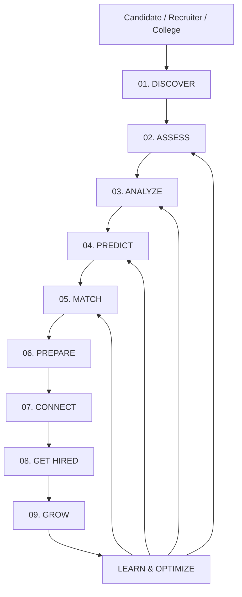
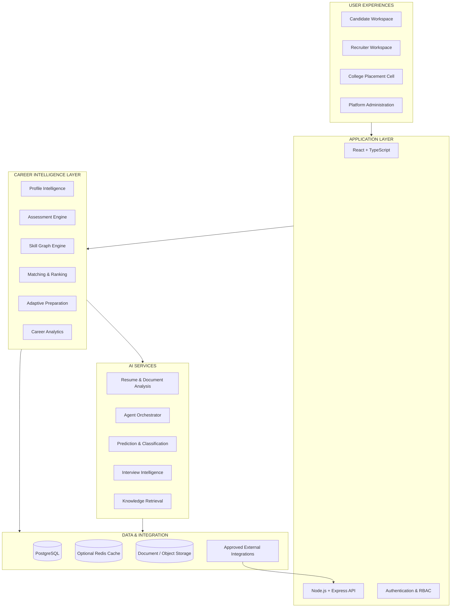
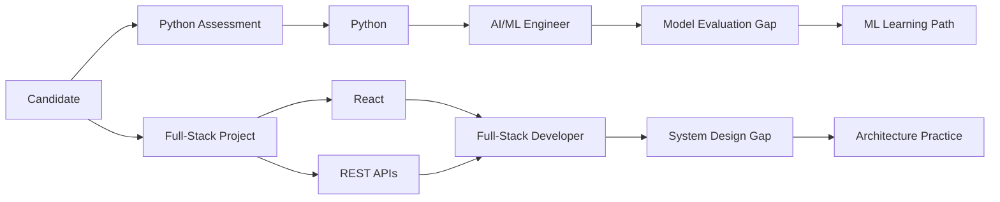
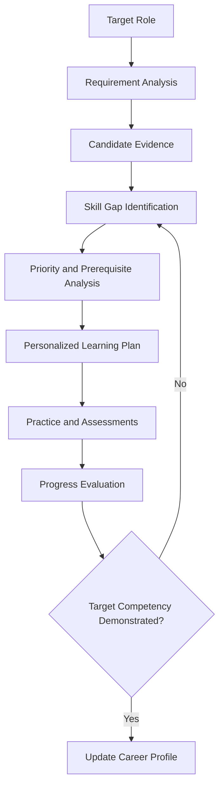

# 🎯 IntelliMatch AI

<div align="center">

# 🤖 INTELLIMATCH AI

### AI-Powered Career, Talent & Placement Intelligence Operating System

**Discover → Assess → Analyze → Match → Prepare → Predict → Connect → Get Hired → Grow**

<p>
  
  
  
  
</p>

<p>
  
  
  
  
  
</p>

**One intelligence platform connecting candidates, recruiters, colleges, assessments, learning pathways, and career opportunities.**

</div>

---

# 🚀 1. Vision

The modern recruitment ecosystem suffers from fragmented information, inconsistent skill evaluation, generic preparation strategies, and inefficient candidate-role matching.

Candidates struggle to identify their actual skill gaps, demonstrate practical ability, prepare for company-specific recruitment processes, and discover opportunities aligned with their capabilities.

Recruiters struggle to evaluate large applicant pools consistently, identify relevant skills, compare evidence of competence, and understand where candidates need further development.

Colleges need better visibility into placement readiness, cohort-level skill gaps, recruitment progress, and the effectiveness of training programs.

**IntelliMatch AI is designed to connect these disconnected workflows through a unified intelligence layer.**

Rather than functioning as a conventional job portal, IntelliMatch builds a continuously updated **Career Intelligence Profile** for every candidate and a corresponding **Talent Intelligence Layer** for recruiters and institutions.

The platform combines profile analysis, practical assessments, explainable matching, adaptive preparation, recruitment workflows, and career progression into one connected system.

### Core mission

> Transform career development and recruitment from fragmented, reactive processes into an evidence-driven, personalized, measurable, and continuously improving intelligence system.

---

# 🧠 2. Core Intelligence Loop



| Stage | Intelligence capability | Primary output |
|---|---|---|
| Discover | Resume parsing, profile enrichment, project and goal extraction | Structured candidate profile |
| Assess | Coding, aptitude, SQL, technical, and communication evaluations | Assessment evidence |
| Analyze | Skill graphs, proficiency estimates, and gap identification | Skill intelligence report |
| Predict | Readiness trends, requirement coverage, and scenario analysis | Forecast with uncertainty |
| Match | Candidate-role compatibility and explainable ranking | Ranked opportunities |
| Prepare | Personalized learning, practice, and mock interviews | Adaptive preparation plan |
| Connect | Applications, recruiters, colleges, and opportunity workflows | Tracked connections |
| Get Hired | Recruitment-stage tracking and placement analytics | Hiring pipeline visibility |
| Grow | Progress tracking, skill updates, and career development | Evolving career profile |

The intelligence loop is designed to update recommendations as new assessment results, completed projects, job requirements, and career goals become available.

---

# 🏛️ 3. Platform Architecture

IntelliMatch AI is designed as a modular platform with distinct application, business, intelligence, and data layers.



### Architectural principles

- **Modular by domain:** Profile, assessment, matching, preparation, and recruitment modules have defined responsibilities.
- **API-first:** Frontend clients and approved integrations communicate through documented APIs.
- **Evidence-driven:** Skill and readiness estimates should reference assessments, projects, or other relevant evidence.
- **Model-independent:** AI providers and predictive models can be replaced without redesigning the entire platform.
- **Privacy-aware:** Candidate information is available only to authorized users and for permitted purposes.
- **Human-governed:** Important recruitment and employment decisions remain reviewable by responsible people.

This is the proposed target architecture. Actual deployment boundaries can remain modular within a single backend until scaling requirements justify separate services.

---

# 👤 4. Career Intelligence Profile

Every candidate receives a structured career profile that evolves as new evidence becomes available.

### Profile dimensions

**Identity and preferences**
- Education and qualifications.
- Preferred job roles and industries.
- Preferred locations and work arrangements.
- Career goals and learning preferences.

**Technical capabilities**
- Programming languages.
- Frameworks and libraries.
- Database technologies.
- Core computer science concepts.
- Cloud, testing, data, and AI/ML capabilities.

**Demonstrated evidence**
- Completed projects.
- Assessment results.
- Coding performance.
- Verified certifications where available.
- Portfolio and repository references.
- Practical experience and internships.

**Career readiness**
- Required-skill coverage.
- Assessment performance.
- Communication practice.
- Role-specific preparation progress.
- Outstanding requirements and improvement priorities.

### Example profile representation

```json
{
  "candidate_id": "candidate_demo_001",
  "target_roles": [
    "Full Stack Developer",
    "AI/ML Engineer"
  ],
  "skills": [
    {
      "name": "Python",
      "evidence_type": "assessment",
      "proficiency": null,
      "confidence": null
    },
    {
      "name": "React",
      "evidence_type": "project",
      "proficiency": null,
      "confidence": null
    }
  ],
  "readiness": {
    "status": "not_assessed",
    "assessment_coverage": 0
  }
}
```

This example intentionally leaves proficiency and confidence unassigned. The system should calculate these from defined evidence and validated scoring rules rather than inventing candidate skill levels.

---

# 🕸️ 5. Skill Intelligence Graph

A flat list of skills is insufficient to represent real-world competence.

IntelliMatch AI can model the relationships between skills, roles, projects, assessments, certifications, and learning resources as a structured skill graph.

### Example relationship model



### Graph entities

- Candidate.
- Skill and subskill.
- Role and job requirement.
- Assessment and result.
- Project and contribution.
- Certification.
- Learning resource.
- Company and recruitment requirement.

### Graph relationships

- Demonstrates skill.
- Requires skill.
- Depends on skill.
- Assessed by.
- Practiced through.
- Strengthened by.
- Relevant to role.
- Verified by evidence.

### Key capabilities

- Identify transferable skills.
- Find missing prerequisite skills.
- Explain role-fit recommendations.
- Generate prerequisite-aware learning paths.
- Detect duplicated or overlapping requirements.
- Connect demonstrated project work with relevant role competencies.

A graph database is not mandatory for the first release. These relationships can initially be implemented using PostgreSQL tables and recursive queries, with a dedicated graph database considered if the workload warrants it.

---

# 📄 6. Intelligent Resume & Document Engine

The document intelligence module converts unstructured career documents into validated, searchable candidate data.

### Processing pipeline

```text
Resume Upload
      ↓
File Type and Security Validation
      ↓
Text Extraction / OCR When Required
      ↓
Section and Entity Extraction
      ↓
Skills, Projects, Education and Experience
      ↓
Schema Validation
      ↓
Candidate Review and Correction
      ↓
Career Intelligence Profile
```

### Capabilities

- PDF and DOCX text extraction.
- Resume section identification.
- Skill and technology extraction.
- Education and experience parsing.
- Project summary and evidence extraction.
- Certification extraction.
- Duplicate skill normalization.
- Job-description comparison.
- Missing-information detection.
- Resume tailoring suggestions.
- ATS-oriented structure and keyword checks.

### Explainable resume analysis

Every extracted item should be traceable to a document section or text passage where possible.

The system should distinguish between:

- Explicitly stated information.
- AI-inferred information.
- Information that needs user confirmation.
- Information that could not be extracted reliably.

It should never fabricate qualifications, work experience, projects, or certifications.

---

# 🧪 7. Unified Assessment Intelligence

IntelliMatch AI brings multiple assessment types into a unified evaluation framework.

| Assessment module | Example evaluation areas |
|---|---|
| Aptitude | Numerical ability, quantitative reasoning |
| Logical reasoning | Patterns, deduction, problem-solving |
| Verbal ability | Grammar, comprehension, vocabulary |
| Coding | Correctness, complexity, edge cases |
| Technical MCQs | Programming, OOP, DBMS, OS, networks |
| SQL | Queries, joins, aggregation, data manipulation |
| Web development | HTML, CSS, JavaScript, React, APIs |
| Communication | Structured responses, clarity, relevance |
| Mock interviews | Technical explanation, behavioral responses |
| Role-specific tests | Skills selected from a defined job requirement |

### Assessment lifecycle

1. Select the target role and assessment blueprint.
2. Generate or select appropriate questions.
3. Deliver the assessment with defined rules.
4. Evaluate responses using transparent scoring criteria.
5. Analyze errors and topic-level performance.
6. Identify evidence-backed skill gaps.
7. Recommend targeted practice.
8. Reassess progress using suitable new questions.

### Scoring architecture

A normalized assessment score may be represented as:

\[
S = \frac{\text{Weighted Earned Points}}
{\text{Weighted Available Points}} \times 100
\]

The scoring engine should define weighting, partial credit, penalties, time limits, and evaluation rules for each assessment type.

Coding evaluations should consider test-case correctness and, where applicable, time complexity, memory usage, and execution constraints.

Communication or interview assessments should use explicit rubrics and should not treat accent, demographic characteristics, or speaking style alone as reliable evidence of job competence.

---

# 🔬 8. Predictive Career Intelligence

The predictive engine aims to transform historical and current evidence into useful decision support.

### Potential predictions and estimates

- Role-specific skill coverage.
- Assessment performance trends.
- Interview preparation progress.
- Learning completion estimates.
- Requirement coverage for a specific vacancy.
- Areas likely to need further preparation.
- Placement pipeline summaries.
- Candidate progress over time.

### Model design

| Task | Candidate approach | Evaluation |
|---|---|---|
| Skill extraction | NLP and structured extraction | Precision, recall |
| Role matching | Semantic similarity and structured ranking | Precision@K, NDCG |
| Assessment analysis | Rules, statistics, supervised models where justified | Calibration and predictive error |
| Learning recommendations | Prerequisite graphs and recommendation methods | Completion and skill-improvement measures |
| Interview readiness | Transparent rubrics and assessment evidence | Agreement with validated evaluation criteria |
| Placement analytics | Cohort-level statistics and trend analysis | Calibration and forecast error where applicable |

### Readiness is not a hiring guarantee

An interview-readiness indicator should be treated as a preparation aid, not a promise of selection.

Any probability-like prediction about hiring outcomes would require suitable historical data, clearly defined labels, bias evaluation, validation, and calibration. Without that evidence, the platform should report transparent requirement coverage or readiness indicators instead of unsupported hiring probabilities.

---

# 🎯 9. Explainable Candidate–Role Matching

IntelliMatch AI uses a structured matching engine to compare candidate evidence against job requirements.

### Matching dimensions

- Required technical skills.
- Preferred skills.
- Relevant project evidence.
- Relevant work experience.
- Assessment performance.
- Role-specific prerequisites.
- Candidate preferences.
- Eligibility criteria where applicable.

### Illustrative ranking model

A configurable ranking score could be expressed as:

\[
M(c,r)=\sum_{i=1}^{n}w_i s_i(c,r)
\]

Where:

- \(c\) represents a candidate.
- \(r\) represents a role.
- \(s_i\) represents a normalized comparison dimension.
- \(w_i\) represents a configured importance weight.

The weights must be selected and validated for the use case. The resulting score is a ranking aid, not an objective measure of a person's worth or a guarantee of success.

### Example explanation

**Role:** Junior Full-Stack Developer

- Required skills demonstrated: JavaScript, React, REST APIs.
- Evidence available: One reviewed project and one coding assessment.
- Requirements needing more evidence: Automated testing and deployment.
- Suggested next step: Complete a role-specific practical assessment.
- Match explanation: Strong overlap in demonstrated frontend and API skills; limited evidence for deployment and testing requirements.

### Ranking safeguards

- Display the criteria contributing to each recommendation.
- Show missing or unverified information.
- Avoid using protected characteristics as ranking features.
- Evaluate disparate impacts where legally and operationally appropriate.
- Keep recruiters responsible for consequential selection decisions.
- Provide a way to correct inaccurate candidate information.

---

# 🧑‍💻 10. Adaptive Career Preparation Engine

The preparation engine converts skill gaps into a structured and personalized improvement plan.

### Learning workflow



### Learning content

- Programming fundamentals.
- Data structures and algorithms.
- Aptitude and logical reasoning.
- Core computer science subjects.
- SQL and database design.
- Web development.
- AI/ML fundamentals.
- Company-specific assessment preparation.
- Technical interview practice.
- HR and behavioral interviews.
- Project-based learning.

### Adaptive prioritization

Learning priorities may consider:

- Importance of the skill for the target role.
- Current assessment performance.
- Skill prerequisites.
- Time available.
- Candidate preferences.
- Evidence of recent improvement.

Recommendations should change when the candidate demonstrates new competence, changes target roles, or updates their availability.

---

# 🎙️ 11. AI Interview Intelligence

The interview module provides structured preparation and feedback.

### Interview modes

- Technical interviews.
- Coding interviews.
- HR interviews.
- Behavioral interviews.
- Project explanation.
- Role-specific scenario interviews.
- Mock group discussion and communication practice.

### Interview workflow

1. Select the target role and interview type.
2. Retrieve relevant competencies and question categories.
3. Generate or select an interview question.
4. Capture the candidate's response.
5. Evaluate it against an explicit rubric.
6. Identify missing technical details or unsupported claims.
7. Provide actionable feedback.
8. Generate a follow-up question based on the response.

### Example evaluation rubric

| Dimension | Evaluation focus |
|---|---|
| Technical correctness | Accuracy of the explanation |
| Problem-solving | Reasoning and approach |
| Structure | Logical organization |
| Examples | Relevant, verifiable examples |
| Role relevance | Alignment with the question |
| Communication | Clarity and completeness |

The platform should disclose when responses are AI-evaluated. Automated scores should support practice and structured review rather than independently determine employment outcomes.

---

# 🤖 12. Multi-Agent Career Intelligence

The agentic layer coordinates specialized tools and workflows.

| Agent | Responsibility |
|---|---|
| Profile Intelligence Agent | Extract and organize candidate information |
| Resume Analysis Agent | Compare resume evidence with target requirements |
| Assessment Agent | Coordinate tests and interpret results |
| Skill Graph Agent | Resolve skill relationships and prerequisites |
| Career Planning Agent | Construct prioritized learning paths |
| Role Matching Agent | Explain candidate-role compatibility |
| Interview Coach Agent | Run mock interviews and provide rubric-based feedback |
| Opportunity Discovery Agent | Retrieve opportunities from approved sources |
| Application Assistant Agent | Prepare application materials and track user-approved actions |
| Progress Intelligence Agent | Summarize changes and reassess learning priorities |

### Agent execution principles

- Use typed tools with explicit input and output schemas.
- Enforce user and tenant authorization at the API layer.
- Limit agents to approved actions.
- Keep important actions auditable.
- Require confirmation before submitting applications or sharing personal data.
- Validate extracted facts before saving them to the candidate profile.
- Treat external job descriptions and uploaded documents as untrusted data.
- Avoid allowing instructions embedded in documents to override platform security policies.

Agents coordinate the workflow; deterministic services remain responsible for permissions, scoring rules, database integrity, and other critical business logic.

---

# 🏢 13. Recruiter Intelligence Workspace

The recruiter workspace is intended to improve visibility into role requirements, candidate evidence, and hiring workflows.

### Capabilities

- Job description creation and structured requirement extraction.
- Candidate search and filtering.
- Explainable candidate-role ranking.
- Assessment assignment and evaluation.
- Interview scheduling workflows.
- Recruitment-stage tracking.
- Candidate comparison against defined criteria.
- Evidence and reviewer notes.
- Shortlisting support.
- Hiring funnel analytics.

### Recruitment pipeline

```text
Job Created
    ↓
Requirements Reviewed
    ↓
Applications Received
    ↓
Eligibility and Evidence Review
    ↓
Assessment / Interview
    ↓
Human Review
    ↓
Decision Recorded
    ↓
Candidate Notified
```

The platform should not automatically reject or exclude candidates solely because of an opaque model score. Recruiters should be able to review evidence, inspect the criteria, and correct errors.

---

# 🎓 14. College Placement Intelligence

The institutional workspace supports placement preparation and cohort-level visibility.

### Features

- Student profile management.
- Skill-gap analysis across a cohort.
- Assessment performance dashboards.
- Role-specific preparation plans.
- Training progress tracking.
- Eligible-opportunity management.
- Recruitment-stage tracking.
- Placement outcome reporting.
- Training effectiveness analysis.

### Institutional analytics

Possible aggregate measures include:

- Assessment participation.
- Skill-wise performance distribution.
- Training completion.
- Interview participation.
- Recruitment-stage conversion.
- Placement outcomes by role or cohort.

Access to individual student information should be permission-controlled. Aggregate reporting should use appropriate privacy protections and should not expose identifiable information unnecessarily.

---

# 📈 15. Career Growth & Continuous Learning

The career profile should continue evolving after a candidate completes an assessment or receives an offer.

### Progress tracking

- New skills demonstrated.
- Project milestones.
- Assessment improvements.
- Learning-path completion.
- Interview practice history.
- Role requirement changes.
- Career goals and preferences.
- Verified employment or certification updates where available.

### Continuous intelligence loop

```text
New Evidence
     ↓
Profile Update
     ↓
Skill Graph Refresh
     ↓
Role Requirement Reassessment
     ↓
Updated Recommendations
     ↓
Learning and Practice
     ↓
New Evidence
```

The system should preserve the history of meaningful changes so candidates can understand how their profile and recommendations evolved.

---

# 🗃️ 16. Data Architecture

PostgreSQL is the proposed primary relational database.

### Core domain entities

| Entity | Purpose |
|---|---|
| `users` | Authentication identities |
| `candidate_profiles` | Candidate preferences and career information |
| `recruiter_profiles` | Recruiter and organization details |
| `institutions` | College and placement-cell information |
| `skills` | Canonical skill definitions |
| `candidate_skills` | Candidate skill evidence and proficiency estimates |
| `projects` | Project descriptions and references |
| `resumes` | Resume metadata and processing status |
| `job_roles` | Structured role definitions |
| `job_requirements` | Role-specific skills and criteria |
| `assessments` | Assessment definitions |
| `assessment_attempts` | Candidate submissions and scores |
| `assessment_responses` | Individual responses and evaluation details |
| `matches` | Candidate-role comparison results |
| `learning_paths` | Personalized preparation plans |
| `learning_activities` | Individual practice and learning tasks |
| `applications` | Candidate applications and status |
| `interviews` | Interview sessions and evaluation records |
| `audit_events` | Important security and workflow events |

### Data engineering principles

- Use stable identifiers and appropriate foreign keys.
- Enforce tenant and ownership boundaries.
- Store timestamps consistently.
- Version assessment definitions and scoring rules.
- Keep model-generated inferences distinguishable from user-provided facts.
- Record the provenance of extracted information.
- Protect sensitive documents and delete them according to the retention policy.
- Avoid storing unnecessary personal data.

---

# 🛠️ 17. Proposed Technology Stack

| Layer | Technology |
|---|---|
| Frontend | React, TypeScript, Vite |
| UI | Tailwind CSS and a consistent component system |
| Charts | Recharts or Chart.js |
| Backend API | Node.js, Express, TypeScript |
| AI service | Python, FastAPI |
| Language processing | Appropriate NLP and structured extraction models |
| Machine learning | scikit-learn, XGBoost, PyTorch where justified |
| LLM integration | Provider-independent model adapter |
| Database | PostgreSQL |
| Data validation | Zod on the TypeScript side, Pydantic in Python |
| Authentication | Secure session or token-based authentication |
| File storage | Private object storage or equivalent |
| Background jobs | A queue and worker system when needed |
| Testing | Vitest, Supertest, Pytest |
| API documentation | OpenAPI |
| Deployment | Docker and CI/CD |
| Monitoring | Structured logs, metrics, and error tracking |

Choose specific providers and frameworks according to actual implementation requirements. Avoid adding infrastructure solely for appearance.

---

# 📂 18. Recommended Repository Structure

```text
intellimatch-ai/
│
├── apps/
│   ├── web/
│   │   └── src/
│   │       ├── app/
│   │       ├── components/
│   │       ├── features/
│   │       │   ├── candidate/
│   │       │   ├── resume/
│   │       │   ├── assessments/
│   │       │   ├── matching/
│   │       │   ├── learning/
│   │       │   ├── interviews/
│   │       │   ├── recruiter/
│   │       │   └── placement/
│   │       ├── hooks/
│   │       ├── services/
│   │       └── types/
│   │
│   └── api/
│       └── src/
│           ├── config/
│           ├── middleware/
│           ├── modules/
│           │   ├── auth/
│           │   ├── candidates/
│           │   ├── resumes/
│           │   ├── skills/
│           │   ├── assessments/
│           │   ├── jobs/
│           │   ├── matching/
│           │   ├── learning/
│           │   ├── interviews/
│           │   ├── applications/
│           │   └── analytics/
│           ├── services/
│           ├── repositories/
│           └── app.ts
│
├── services/
│   └── ai/
│       ├── app/
│       │   ├── api/
│       │   ├── extraction/
│       │   ├── matching/
│       │   ├── assessment/
│       │   ├── interview/
│       │   ├── agents/
│       │   └── evaluation/
│       └── tests/
│
├── packages/
│   ├── shared-types/
│   ├── validation/
│   └── scoring/
│
├── database/
│   ├── migrations/
│   ├── seeds/
│   └── schema/
│
├── tests/
│   ├── integration/
│   ├── e2e/
│   └── security/
│
├── docs/
│   ├── architecture/
│   ├── api/
│   ├── data-model/
│   └── security/
│
├── infrastructure/
│   ├── docker/
│   └── deployment/
│
├── .env.example
├── .gitignore
├── docker-compose.yml
├── LICENSE
└── README.md
```

This is a proposed monorepo layout. Modules can be simplified or combined depending on the existing codebase.

---

# 🔌 19. Proposed API Architecture

Use a versioned API with consistent validation, authorization, error responses, and pagination.

| Method | Endpoint | Purpose |
|---|---|---|
| `GET` | `/api/v1/health` | API health check |
| `GET` | `/api/v1/candidates/me` | Retrieve the authenticated candidate profile |
| `PATCH` | `/api/v1/candidates/me` | Update editable profile fields |
| `POST` | `/api/v1/resumes` | Upload a resume |
| `GET` | `/api/v1/resumes/{id}/status` | Check processing status |
| `GET` | `/api/v1/candidates/me/skills` | Retrieve skill evidence |
| `POST` | `/api/v1/assessments` | Create an assessment where authorized |
| `POST` | `/api/v1/assessments/{id}/attempts` | Start an assessment attempt |
| `POST` | `/api/v1/attempts/{id}/submit` | Submit assessment responses |
| `GET` | `/api/v1/candidates/me/matches` | Retrieve role matches |
| `POST` | `/api/v1/matches/explain` | Explain a candidate-role comparison |
| `GET` | `/api/v1/learning-paths/me` | Retrieve the current learning plan |
| `POST` | `/api/v1/interviews/sessions` | Create a mock interview session |
| `GET` | `/api/v1/applications` | Retrieve authorized application records |
| `GET` | `/api/v1/analytics/placement` | Retrieve authorized placement analytics |

These are proposed endpoints, not claims of existing implementation. Recruiter and institution endpoints require appropriate role and tenant checks.

---

# 🔐 20. Security, Privacy & Responsible AI

Career data can contain sensitive personal information. Security and fairness must be part of the architecture from the beginning.

### Application security

- Secure authentication and authorization.
- Role-based access control.
- Tenant-level data isolation.
- File upload validation and malware scanning where available.
- Rate limiting and request validation.
- Secure secret management.
- Audit logging for sensitive operations.
- Protected storage and controlled document access.
- Dependency and vulnerability scanning.

### Responsible AI

- Keep candidate data collection limited to legitimate purposes.
- Make important matching criteria visible.
- Provide mechanisms to correct inaccurate information.
- Avoid protected-characteristic proxies where inappropriate.
- Evaluate model performance and disparate impacts.
- Keep AI-generated inferences distinguishable from verified facts.
- Provide human review for consequential decisions.
- Obtain authorization before sharing or submitting candidate information.
- Define retention and deletion policies.
- Avoid unsupported claims about selection probability or future salary.

**IntelliMatch AI is a decision-support platform. AI-generated rankings, readiness estimates, and interview feedback must not be presented as guaranteed hiring outcomes.**

---

# 🧪 21. Testing & Quality Engineering

### Unit tests

- Resume parsing and normalization.
- Skill taxonomy mapping.
- Assessment scoring.
- Matching calculations.
- Learning-path prerequisites.
- Authorization policies.
- Input validation.

### Integration tests

- Authentication and profile access.
- Database transactions.
- AI provider adapters.
- File processing.
- Assessment submission and scoring.
- Matching and recommendation workflows.
- Recruiter and institution permissions.

### End-to-end tests

- Candidate onboarding.
- Resume upload and profile review.
- Assessment completion.
- Role discovery and matching.
- Learning-path generation.
- Mock interview completion.
- Recruiter review and application tracking.

### AI evaluation

- Extraction precision and recall.
- Match ranking quality.
- Recommendation relevance.
- Assessment scoring consistency.
- Interview rubric consistency.
- Robustness to incomplete or misleading input.
- Fairness and performance across appropriate evaluation groups.

AI services should have deterministic test fixtures where possible and regression tests for changes in model behavior.

---

# 📊 22. Product Analytics & Success Metrics

| Category | Metric |
|---|---|
| Onboarding | Profile completion and successful document processing |
| Resume intelligence | Extraction precision, recall, and correction rate |
| Assessments | Completion rate and topic-level improvement |
| Matching | Precision@K, NDCG, recruiter review outcomes |
| Learning | Activity completion and measured skill improvement |
| Interviews | Rubric-level progress and user feedback |
| Recruitment | Pipeline-stage conversion and time-to-stage |
| Reliability | API availability, error rate, processing latency |
| Security | Access-control failures and unresolved vulnerabilities |
| Fairness | Evaluation of ranking outcomes across appropriate groups |

Metrics should be interpreted with context. For example, a high click-through rate does not prove a job match is accurate, and a high model score does not establish that a candidate will be hired.

---

# 🚀 23. Development Roadmap

## Phase 1 — Career Platform Foundation

- [ ] Authentication and role-based access.
- [ ] Candidate and recruiter profiles.
- [ ] PostgreSQL schema and migrations.
- [ ] Resume upload and extraction.
- [ ] Structured skill profiles.
- [ ] Initial dashboard and API documentation.

## Phase 2 — Assessment Intelligence

- [ ] Aptitude and technical assessment modules.
- [ ] Coding assessment integration.
- [ ] SQL and core-subject question banks.
- [ ] Transparent scoring and topic-level analysis.
- [ ] Assessment history and progress tracking.

## Phase 3 — Matching & Skill Graph

- [ ] Canonical skill taxonomy.
- [ ] Structured job requirements.
- [ ] Candidate-role matching engine.
- [ ] Explainable ranking results.
- [ ] Skill-gap identification.
- [ ] Match-quality evaluation.

## Phase 4 — Personalized Preparation

- [ ] Learning-path generation.
- [ ] Practice recommendations.
- [ ] Coding and technical preparation.
- [ ] Mock interview workflows.
- [ ] Progress-based plan updates.

## Phase 5 — Agentic Intelligence

- [ ] Specialized agent tools.
- [ ] Controlled orchestration.
- [ ] Knowledge retrieval.
- [ ] Evidence-backed recommendations.
- [ ] Human approval workflows.
- [ ] Audit trails and error handling.

## Phase 6 — Recruitment & Placement

- [ ] Recruiter workspace.
- [ ] Job and application workflows.
- [ ] College placement dashboards.
- [ ] Recruitment-stage tracking.
- [ ] Cohort-level analytics.
- [ ] Privacy-aware reporting.

## Phase 7 — Production Maturity

- [ ] Automated integration and end-to-end tests.
- [ ] AI model evaluation and versioning.
- [ ] Production monitoring.
- [ ] Security and fairness reviews.
- [ ] Data retention controls.
- [ ] Deployment and recovery procedures.

---

# 🌐 24. Target Users & Use Cases

### Candidates and students

- Understand current skills and evidence.
- Identify role-specific gaps.
- Discover relevant opportunities.
- Prepare for aptitude and technical tests.
- Practice interviews.
- Track applications and learning progress.

### Recruiters and hiring teams

- Structure job requirements.
- Search relevant candidate profiles.
- Compare evidence against role criteria.
- Coordinate assessments and interviews.
- Review recruitment pipeline analytics.

### Colleges and placement cells

- Identify common student skill gaps.
- Organize role-specific training.
- Monitor assessment progress.
- Coordinate campus recruitment.
- Evaluate placement preparation outcomes.

### Training providers

- Map course outcomes to relevant competencies.
- Recommend prerequisite learning.
- Track learner progress.
- Evaluate skill development.

---

# 💎 25. Why IntelliMatch AI?

| Traditional career platforms | IntelliMatch AI vision |
|---|---|
| Store resumes | Build evolving career intelligence profiles |
| Search jobs by keywords | Compare structured requirements and evidence |
| Offer generic learning content | Generate role-specific learning paths |
| Use isolated tests | Connect assessments with skill evidence |
| Provide static job recommendations | Reassess matches as candidate profiles evolve |
| Offer generic interview questions | Generate structured, role-aware interview practice |
| Track applications separately | Connect preparation, applications, and recruitment stages |
| Display basic placement statistics | Provide evidence-driven cohort and pipeline analytics |

The central differentiator is the connection between **demonstrated skills, role requirements, assessment evidence, personalized preparation, and recruitment outcomes**.

---

# 🤝 26. Contribution Guidelines

Contributions are welcome across:

- Frontend and backend engineering.
- Resume parsing and NLP.
- Skill taxonomy and graph design.
- Assessment engines.
- Candidate-role matching.
- Recommendation systems.
- AI agent orchestration.
- Interview preparation.
- Security and responsible AI.
- Testing and documentation.

### Contribution workflow

1. Fork the repository.
2. Create a feature branch.
3. Implement the change with appropriate tests.
4. Document new configuration and API behavior.
5. Run relevant quality checks.
6. Submit a pull request describing the change and its limitations.

Contributions affecting ranking, assessment scoring, access control, or candidate data handling should include suitable validation and review.

---

# 📜 27. License

IntelliMatch AI is intended to be distributed under the MIT License. Add the complete license text to the repository's `LICENSE` file before publishing under that license.

---

# 🔭 28. Long-Term Vision

IntelliMatch AI aims to evolve into a unified intelligence layer across the career lifecycle.

It will connect:

- What a candidate knows.
- What a candidate can demonstrate.
- What a role requires.
- What evidence is still missing.
- What the candidate should learn next.
- Which opportunities align with their preferences.
- How recruitment progresses.
- How skills develop over time.

The long-term objective is not merely to automate job search. It is to create a transparent, evidence-driven system that helps people make better career decisions and helps organizations evaluate talent more consistently.

<div align="center">

### 🎯 INTELLIMATCH AI

**From Resume Screening to Career Intelligence.**

*Discover potential. Validate skills. Build capability. Connect opportunity.*

</div>
